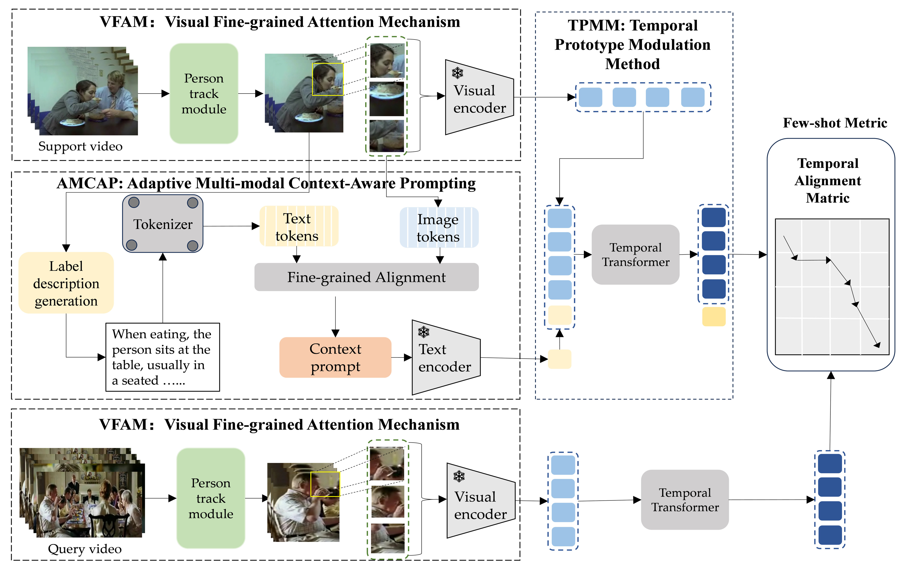

# Multi-modal Context Dynamic Prompt Learning for Few-shot Action Recognition



> **Multi-modal Context Dynamic Prompt Learning for Few-shot Action Recognition**<br>
> Shangen Lan, Jiacheng Lin, Zhidong Su, Guanci Yang
>
>
<!-- > [Paper](https://arxiv.org/pdf/2303.02982.pdf) -->
>
>
> **Abstract:** *Few-Shot Action Recognition (FSAR) holds great promise for real-world applications but struggles when action categories are visually similar yet semantically distinct (e.g., sitting vs. squatting,
drinking water vs. answering the phone). Unlike humans, who disambiguate such actions by analyzing hierarchical visual cues—such as hand movements, interaction mode, and head motion, existing
FSAR methods typically rely on global semantic similarity, limiting their discriminative power for
fine-grained contexts. In this paper, we propose Multi-modal Context Dynamic Prompt Learning
for Few-Shot Action Recognition (MCDP-FSAR), a prompt learning based framework that exploits
multi-modal semantic priors to provide robust and adaptive contextual representations for few-shot
action recognition. We introduce a visual fine-grained attention mechanism (VFAM) in the FSAR,
which leverages object-tracking algorithms to shift attention from the global scene to individual
entities, thereby reducing background interference. In addition, we propose Adaptive multi-modal
contextual alignment prompting (AMCAP). It generates semantically meaningful visual regions
via Shapley Interaction modeling, and then selects salient image areas using an attention score
matrix, aligning them with corresponding textual tokens to construct rich multi-modal contextual
prompts. This synergy enables the model to capture subtle action distinction. Extensive experiments
on three benchmark datasets demonstrate that MCDP-FSAR consistently achieves state-of-the-art
performance, significantly outperforming existing approaches.*


This code is based on [CLIP-guided Prototype Modulating for Few-shot Action Recognition](https://github.com/alibaba-mmai-research/CLIP-FSAR) codebase. 

## Installation

Requirements:
- Python>=3.6
- torch>=1.5
- torchvision (version corresponding with torch)
- simplejson==3.11.1
- decord>=0.6.0
- pyyaml
- einops
- oss2
- psutil
- tqdm
- pandas

optional requirements
- fvcore (for flops calculation)

Or you can create environments with the following command:
```
conda env create -f environment.yaml
```

## Data preparation

First, you need to download the datasets from their original source (If you have already downloaded, please ignore this step
):

- [SSV2](https://20bn.com/datasets/something-something#download)
- [Kinetics](https://github.com/Showmax/kinetics-downloader)
- [UCF101](https://www.crcv.ucf.edu/data/UCF101.php)
- [HMDB51](https://serre-lab.clps.brown.edu/resource/hmdb-a-large-human-motion-database/#Downloads)

Then, prepare data according to the [splits](configs/projects/MoLo) we provide.

## Running
The entry file for all the runs are `runs/run.py`. 

Before running, some settings need to be configured in the config file. 
The codebase is designed to be experiment friendly for rapid development of new models and representation learning approaches, in that the config files are designed in a hierarchical way.

For an example run, open `configs/projects/CLIPFSAR/kinetics100/CLIPFSAR_K100_1shot_v1.yaml`

A. Set `DATA.DATA_ROOT_DIR` and `DATA.DATA_ANNO_DIR` to point to the kinetics dataset, 

B. Set the valid gpu number `NUM_GPUS`

Then the codebase can be run by:
```
python runs/run.py --cfg configs/projects/CLIPFSAR/kinetics100/CLIPFSAR_K100_1shot_v1.yaml
```

## Citation
If you find this code useful, please cite our paper.

~~~~
@article{
  title={Multi-modal Context Dynamic Prompt Learning for Few-shot Action Recognition},
  author={Shangen Lan, Jiacheng Lin, Zhidong Su, Guanci Yang},
  year={2026}
}
~~~~
